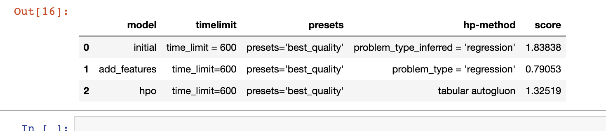
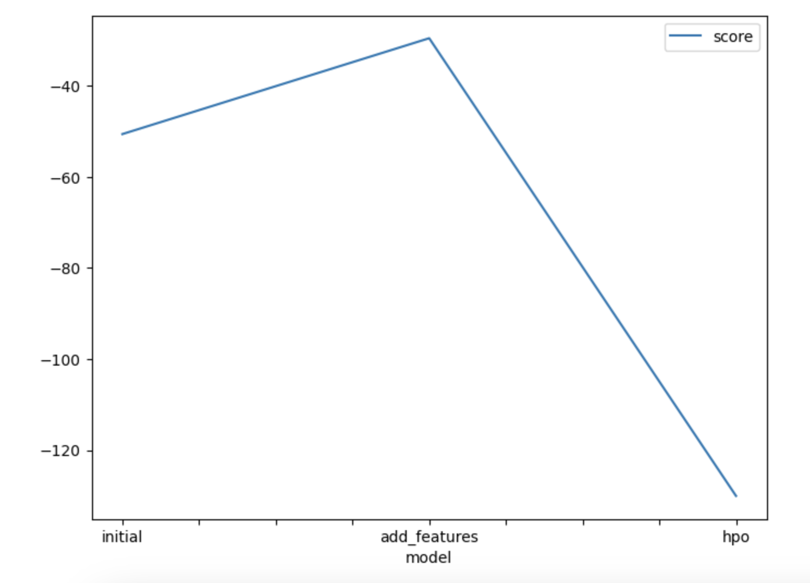
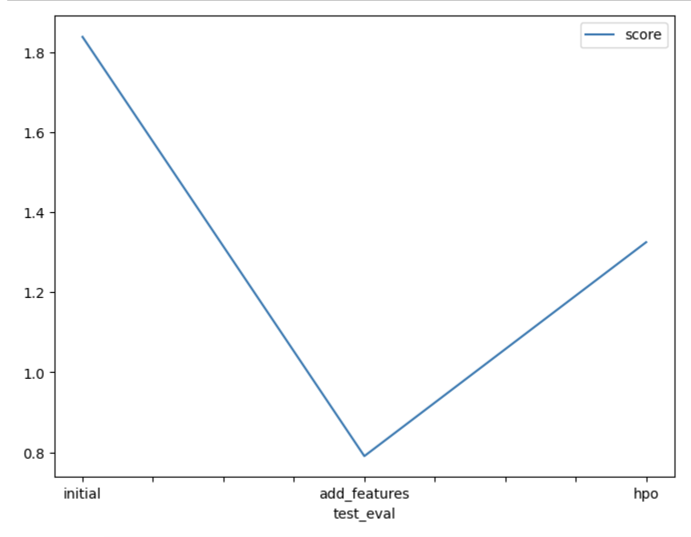

# Report: Predict Bike Sharing Demand with AutoGluon Solution
#### Luong Bui

## Initial Training
### What did you realize when you tried to submit your predictions? What changes were needed to the output of the predictor to submit your results?

Had to find out how to run locally on my laptop the whole notebook. Challenge was to use python 3.9 for autogluon while I have python 3.10 on my host.
Also I have to downgrade to libomp 11 otherwise lightgbm would make the kernel crash.

I have documented everything in the README.

I had to set all negative predictions to zero, as you cannot have a negative number of bikes predicted.

### What was the top ranked model that performed?

Second run with more features but no hyperparameter optimizations.

The name of the model is WeightedEnsemble_L3

## Exploratory data analysis and feature creation
### What did the exploratory analysis find and how did you add additional features?

Splitted the datetime in day month year as suggested.

### How much better did your model preform after adding additional features and why do you think that is?

By adding the features my model improved by 43%. I think that is due to the more time granularity.

## Hyper parameter tuning
### How much better did your model preform after trying different hyper parameters?

Better than the initial model but worse than the model with new features.

I have not spend any time in trying different hyper parameters.

### If you were given more time with this dataset, where do you think you would spend more time?

Probably more time adding features and more time in playing around with the hyper parameters.

For the new features maybe it is worth to add some seasonal spikes and maybe also the time of the day.

### Create a table with the models you ran, the hyperparameters modified, and the kaggle score.

### Create a line plot showing the top model score for the three (or more) training runs during the project.

### Create a line plot showing the top kaggle score for the three (or more) prediction submissions during the project.

## Summary

EDA proved to be effective in improving the model, by adding features.

